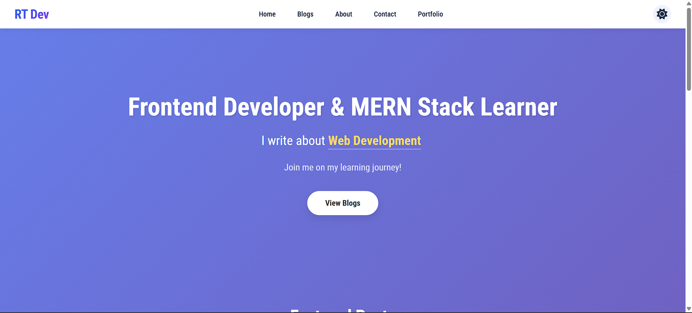

# Rahul Tech Blog

A personal tech blog built with **HTML, CSS, and JavaScript** to showcase frontend development skills and share knowledge about web technologies.

  
*(Replace with an actual screenshot of your homepage)*

## ✨ Features

- **Responsive Navbar** – Sticky, with logo, navigation links, dark mode toggle, and hamburger menu for mobile.
- **Hero Section** – Animated typing effect highlighting topics (HTML, CSS, JavaScript, React, MERN Stack).
- **Featured Posts** – Three highlighted blog cards with images, categories, excerpts, and dates.
- **Latest Blog Posts** – Grid of six cards with category filter buttons (All, HTML, CSS, JavaScript, Tips).
- **9 Unique Blog Posts** – Detailed post pages with headings, code blocks, tip boxes, and a static comment section.
- **About Page** – Personal bio and skills list.
- **Contact Page** – Contact form and social links (UI only for demo).
- **Dark Mode** – Toggleable dark theme with preference saved in `localStorage`.
- **Scroll to Top Button** – Appears after scrolling down, smooth scroll to top.
- **Smooth Scrolling** – For internal anchor links.
- **Fully Responsive** – Works on desktop, tablet, and mobile.

## 🛠️ Technologies Used

- HTML5
- CSS3 (Flexbox, Grid, CSS Variables, Animations)
- JavaScript (ES6)
- [Font Awesome](https://fontawesome.com) (icons)
- [Google Fonts](https://fonts.google.com) (Roboto Condensed)

## 🚀 Live Demo

[View Live Demo](https://your-username.github.io/rahul-tech-blog/)  
*(Replace with your GitHub Pages URL after deployment)*

## 📂 Folder Structure
rahul-tech-blog/
├── index.html
├── about.html
├── contact.html
├── post.html (Closures in JavaScript)
├── post2.html (Modern CSS Grid Techniques)
├── post3.html (React Hooks – useEffect)
├── post4.html (Semantic HTML5 Elements)
├── post5.html (5 Productivity Tips for Developers)
├── post6.html (Flexbox vs Grid: When to Use Which)
├── post7.html (10 JavaScript Array Methods)
├── post8.html (Async/Await vs Promises)
├── post9.html (Creating Dark Mode with CSS Variables)
├── style.css
├── script.js
├── assets/
│ ├── icons/ # Favicon files
│ └── images/ # Optional images (screenshots, profile pic)
└── README.md


## 🧑‍💻 Getting Started

1. **Clone the repository**
   ```bash
   git clone https://github.com/your-username/rahul-tech-blog.git

  2. Navigate to the project folder
  cd rahul-tech-blog

  Open index.html in your browser
Double‑click the file, or use a live server extension in VS Code.

No build tools or dependencies required – it's pure static HTML/CSS/JS.

📄 License
This project is open source and available under the MIT License.

🙌 Acknowledgements
Unsplash for placeholder images.

Font Awesome for icons.

Google Fonts for the Roboto Condensed font.


Made with ❤️ by Rahul

